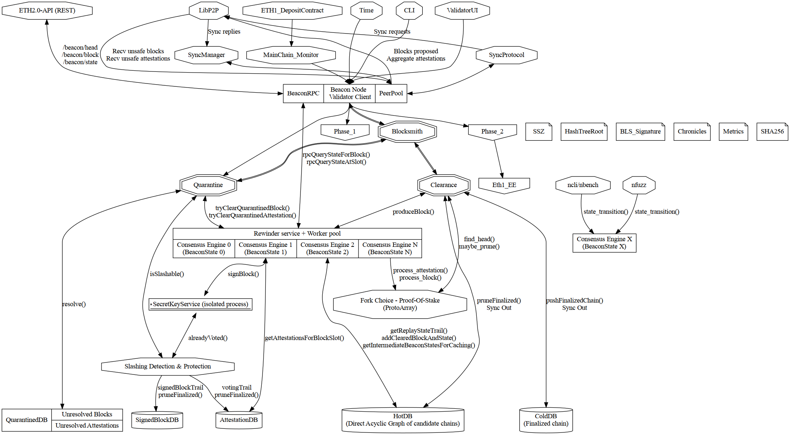

# Blocksmith

Blocksmith is a design RFC for a scalable Eth2 blockchain client.

See Eth2 specification at: https://github.com/ethereum/eth2.0-specs

It is a refactoring proposal for NBC (https://github.com/status-im/nim-beacon-chain)
with the following features:

- Service/Actor-like architecture with communication between services done by message-passing
- Loose-coupling between services
- Defined and restricted capabilities per service
- Multithreaded services.

The RFC has the following goals:

- be a support document for future development, audits, testing, fuzzing and documentation efforts.
- propose a direction for the codebase and gives more structure as it has so far grow in an organic way.

## Proposed architecture for Eth2 phase 0

The architecture is detailed in [architecture_phase0.md](architecture_phase0.md)

## Services

The HotDB service is detailed in [hotdb.md](hotdb.md).
It is in charge of providing:
- a cache for the direct acyclic graph (DAG) of blocks since the last finalized block.
- a cache for some intermediate states of the DAG so that we can recompute a certain state
  within a memory and CPU budget.

The Rewinder service is detailed in [rewinder.md](rewinder.md)
It is in charge of all operations that are applied to a certain state of the blockchain:
- validating a block
- validating an attestation
- producing a new block

