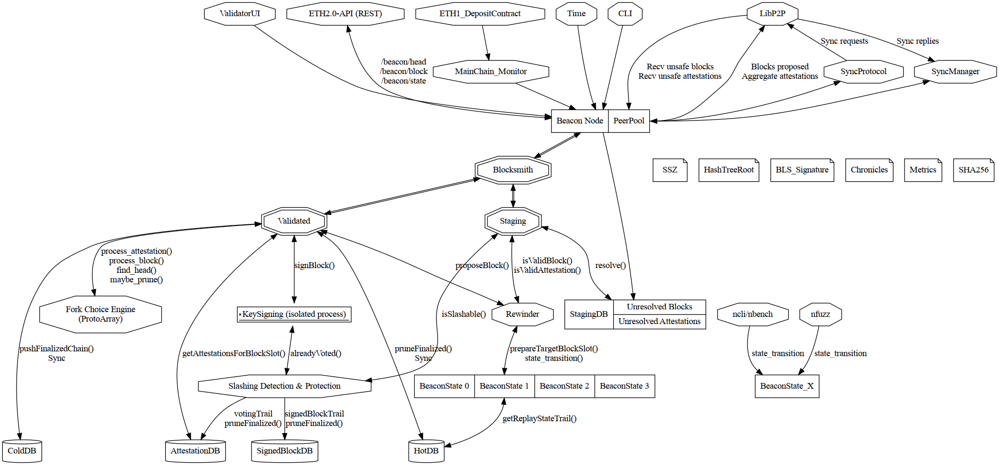

# Architecture

The desired architecture of NBC (nim-beacon-chain) is the following:
- An API layer composed of "Beacon Node" + PeerPool.
  It is the interface with unsafe endpoints such as the REST API or LibP2P
- A "Firewall" layer composed of the replacement of the current modules:
  - blockpool.nim
  - attestation_pool.nim
  - attestation_aggregation.nim
  The replacements are:
  - "Blocksmith"
  - "Staging"
  - "Validated"
  The idea is to highlight the implicit "firewall" between non-validated blocks and attestations
  and cleanly separate modules (and types) that deal with tainted network data,
  and modules that operate on clean data.
- Furthermore the "Rewinder" should be separated out from the blockpool:
  - It is one of the most compute intensive service given that it's triggered at
    - each incoming attestation to verify it's validity
    - each incoming block to verify its validity
    - each block proposal
  - It has been multithreaded, with a the Rewinder service managing a pool of temporary beacon state "RewinderWorker".
    and distributing the attestation validation, block validation and head block requests
    asynchronously on a ready "RewinderWorker".
- The block pool tables and caches duties are moved to a HotDB and StagingDB
  - This makes the core part of the firewall stateless
  - Storage is separate from logic and both are easier to optimize independently.
- The HotDB will only hold the blockchains DAG since the last finalized block.
  2 possibilities are available regarding its use from the Rewinder service:
  - If made threadsafe, for example via a channel to receive queries
    each "RewinderWorker" can independently interact with it.
  - Otherwise the "RewinderSupervisor" extract data from the HotDB (setStateAtBlockSlot) and is in charge of passing it to the target RewinderWorker
