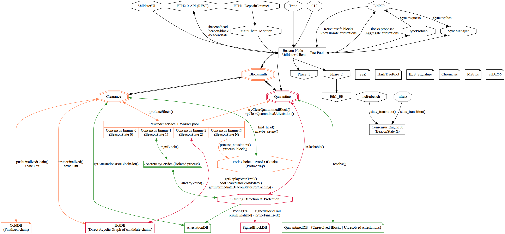

# Message-passing

## Dealing with the cost of copying

The most obvious cost of message passing is copying the message into the buffer.
If we take the BeaconState, which is about 2.7MB of stack memory + some dynamic memory,
this might seem like overhead that would be too costly.

However:
- Only 2 services, interact by passing such big messages, the HotDB and the Rewinder for `getReplayStateTrail()`
  - Technically the `sync` services also do that but there is no alternative to message-passing to send data trhough the network.
- Copies only happens once, to copy from the HotDB to the response channel.
  "Copying" from the response channel to the Rewinder is actually a move since it's the sole owner of the data.
  and so it's just copying a pointer at a low-level.
- Copies can be overlapped with costly processing, usually `hash_tree_root` of the consensus object. If we use block validation as an example:
  ```Nim
  proc isValidBeaconBlockP2PExWorker(
       resultChan: ptr Channel[bool]],
       wrk: RewinderWorker,
       unsafeBlock: QuarantinedBlock
     ) =
  ## Expensive block validation.
  ## The unsafeBlock parent MUST be in the HotDB before calling this proc

  wrk.hotDB.getReplayStateTrail(wrk.stateTrailChan.addr, wrk.hotDB, unsafeBlock.parent_root))

  # Block until we get the stateTrail
  # TODO: we can optimize the copy to not reallocate
  (wrk.state, wrk.blocks) = wrk.stateTrailChan.recv()

  # Move the local worker state to the desired state
  wrk.state.apply(wrk.blocks) # `apply` is an internal procs that applies each `ValidBeaconBlock`

  # Check that the proposer signature, signed_beacon_block.signature, is valid with
  # respect to the proposer_index pubkey.
  let
    blockRoot = hash_tree_root(unsafeBlock.message)
    domain = get_domain(wrk.state, DOMAIN_BEACON_PROPOSER, compute_epoch_at_slot(unsafeBlock.message.slot))
    signing_root = compute_signing_root(blockRoot, domain)
    proposer_index = unsafeBlock.message.proposer_index

  if proposer_index >= wrk.state.validators.len.uint64:
    resultChan.send false
    return
  if not blsVerify(
           wrk.state.validators[proposer_index],
           signing_root.data, unsafeBlock.signature
         ):
    debug "isValidBeaconBlockP2PEx: block failed signature verification"
    resultChan.send false
    return

  resultChan.send true

  # TODO: check if the block come from the expected proposer
  #       and immediately attest to it
  ```
  we can move hashTreeRoot() and other assignment to hide the HotDB latency
  proc isValidBeaconBlockP2PExWorker(
       resultChan: ptr Channel[bool]],
       wrk: RewinderWorker,
       unsafeBlock: QuarantinedBlock
     ) =
  ## Expensive block validation.
  ## The unsafeBlock parent MUST be in the HotDB before calling this proc

  wrk.hotDB.getReplayStateTrail(wrk.stateTrailChan.addr, wrk.hotDB, unsafeBlock.parent_root))

  ## Hide latency of getting a state via message-passing
  let
    blockRoot = hash_tree_root(unsafeBlock.message)
    signing_root = compute_signing_root(blockRoot, domain)
    proposer_index = unsafeBlock.message.proposer_index

  # Block until we get the stateTrail
  # TODO: we can optimize the copy to not reallocate
  (wrk.state, wrk.blocks) = wrk.stateTrailChan.recv()

  # Move the local worker state to the desired state
  wrk.state.apply(wrk.blocks) # `apply` is an internal procs that applies each `ValidBeaconBlock`

  # Check that the proposer signature, signed_beacon_block.signature, is valid with
  # respect to the proposer_index pubkey.
  let domain = get_domain(wrk.state, DOMAIN_BEACON_PROPOSER, compute_epoch_at_slot(unsafeBlock.message.slot))

  if proposer_index >= wrk.state.validators.len.uint64:
    resultChan.send false
    return
  if not blsVerify(
           wrk.state.validators[proposer_index],
           signing_root.data, unsafeBlock.signature
         ):
    debug "isValidBeaconBlockP2PEx: block failed signature verification"
    resultChan.send false
    return

  resultChan.send true

  # TODO: check if the block come from the expected proposer
  #       and immediately attest to it
  ```

## Channel optimization

In the current architecture, all channels are Multi-Producer-Single-Consumer (MPSC - input tasks) or Single-Producer-Single-Consumer (SPSC - input tasks and output outcomes/results), in case they become a bottleneck the following optimisations can be done in order of risk and performance improvement:

- SPSC channel for a single item:
  - stack object: https://github.com/mratsim/weave/blob/943d04ae/weave/cross_thread_com/channels_spsc_single.nim
  - pointer object: https://github.com/mratsim/weave/blob/943d04ae/weave/cross_thread_com/channels_spsc_single_ptr.nim
- Michael & Scott - Bounded MPMC 2 locks queue
  - The use of 2-locks, 1 for the Producer and 1 for the consumer
    significantly reduce contention
  - Paper (use the blocking queue):\
    Simple, Fast, and Practical Non-Blocking and BlockingConcurrent Queue Algorithms\
    Maged M. Michael    Michael L. Scott, 1996\
    https://www.cs.rochester.edu/u/scott/papers/1996_PODC_queues.pdf
  - Nim implementation (including a channel caching system):
    https://github.com/mratsim/weave/blob/550059ba/unused/channels/channels_legacy.nim
- Bounded wait-free SPSC channel backed by a ring-buffer:
  - See implementation details here: https://github.com/mratsim/weave/blob/943d04ae/weave/cross_thread_com/channels_spsc.md in particular:
    - Save on memory by not using an empty queue slot to differentiate between empty and full queue. (Very expensive if it's a queue of BeaconState)
    - Save on memory by not requiring power of 2 buffer size. (Very expensive if it's a queue of BeaconState)
    - Save on CPU by not requiring a modulo operation. (Very expensive)
  - The following queue can implement those details and can be made into
    such a channel by making the front/back field `Atomic[int]` and properly pad them to avoid false sharing https://github.com/mratsim/weave/blob/943d04ae/weave/datatypes/bounded_queues.nim
- Lockless MPSC channels (either intrusive-list-based or non-intrusive).
  - Non-intrusive Vyukov queues are easier to add http://www.1024cores.net/home/lock-free-algorithms/queues/non-intrusive-mpsc-node-based-queue
    but will require a threadsafe lock-free memory pool to not swamp the GC (and the GC uses lock for shared memory).

At first glance, Nim channels are probably good enough until proven otherwise. SPSC channels for single item can easily be use to propagate results and the 2-locks based channels are an easy upgrade on Nim channels to reduce contention between producers and consumers.

## Channel ownership, supervision and resilience

As an alternative to consumer/executor/services owning their incoming channels,
we can introduce a "Channel Broker" service which owns all channels.

### Supervision

This allows having a single place to monitor the beacon node load, which is proxied by the number of messages pending in a channel and/or their depletion rate.

> Note: The metrics system can also deduce the load if a process logic is 1 message in leads to 1 message out, for example in the HotDB, a `getReplayStateTrail()` message. However some messages do not require acknowledgement, for example `addClearedBlockAndState()`. This can be workaround by having a count also on the HotDB side.

This can be used to display such monitoring graphs.



This hypothetical situation probably depicts
- an overwhelmed slashing detection
- and a HotDB with too many `getReplayStateTrail()` enqueued or too many newly cleared blocks and BeaconState enqueued

This can be used a posteriori to focus optimization efforts on those components, but it can also be used dynamically in the application so that
the monitoring service asks:
- the peer pool to drop peers
- the peer pool to drop sync requests (i.e. "adaptative node")
- the slashing detection to stop trying to slash incoming attestations (but slashing protection is very infrequent and be left on)

### Resilience

> Important: it is probably much simpler to stop the whole program and restart

In case of failure of a service, for example due to a time/clock bug, an underflow, the service is shutdown and what was being processed is lost.
However the channels with the incoming and outgoing messages are still up.
If the channels are owned by a "Channel Broker", a new service can be started and it can takeover the pending message queue. The message/task that led to the crash is not in the incoming channel anymore.
